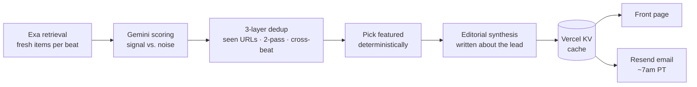

# 🛰️ Frontier AI Digest

**Every morning, a small swarm of agents reads the AI frontier so you don't have to.**

[](https://frontier-ai-digest.vercel.app/)


A daily, automated news digest for frontier AI. It tracks ~130 companies across four beats, retrieves the day's real developments, scores them for signal, writes an editorial synthesis, and emails the result. No human in the loop after deploy.

👉 **Read today's:** [frontier-ai-digest.vercel.app](https://frontier-ai-digest.vercel.app/)

---

## The four beats

| Beat | What it watches |
|------|-----------------|
| 🤖 **Physical AI** | Robotics foundation models, humanoids, embodied agents |
| 🏗️ **AI Infrastructure** | Chips, inference, training stacks, the picks-and-shovels layer |
| 🧪 **AI Labs** | Frontier model releases, research, the labs themselves |
| 📊 **Vertical AI** | AI going deep into one industry at a time |

Each beat runs on its own cron, scores its own stories, and feeds one shared front page and email.

## How a digest gets made



1. **Retrieve.** [Exa](https://exa.ai) pulls the day's primary-source items for each beat. Exa is tuned for event recall (breaking, primary sources), not aggregator answers.
2. **Score.** Gemini ranks each item for "would a frontier-watcher actually care," with explicit signal/noise reasoning.
3. **Dedup, three ways.** Exa-level `seenUrls`, a Gemini two-pass collapse, and a cross-beat URL dedup at the aggregation layer so the same story never shows up twice in two costumes.
4. **Choose the lead, then write about it.** The featured article is picked deterministically *first*; the editorial synthesis is generated to describe that exact lead, so the headline and the thesis can never drift apart.
5. **Cache + deliver.** Results land in Vercel KV; the front page reads from cache and a [Resend](https://resend.com) email goes out each morning.

## Built to survive a bad API day

The interesting engineering here is in the failure modes, not the happy path:

- **503 resilience.** The heavier Gemini Flash models throw intermittent "high demand" 503s. Every model call retries, then falls back to `gemini-2.5-flash-lite` (a separate, healthier capacity pool) with a valid thinking budget. A bad spike degrades quality, it never empties the cache.
- **Untrusted by default.** Web and search text is treated as a prompt-injection vector: fenced, kept out of the system instruction, and any model-emitted URL is guarded (an HTML escaper alone won't stop a `javascript:` href).
- **No silent data loss.** If a beat refresh fails outright, it re-throws *before* overwriting the cache, so a failed cron can never replace good stories with an empty array.

## Stack

`Next.js` (App Router) · `TypeScript` · `Tailwind` · `@google/genai` (Gemini) · `exa-js` · `Resend` · `@vercel/kv` · `zod` · deployed on `Vercel` with cron + analytics.

## Running it yourself

```bash
npm install
npm run dev          # http://localhost:3000
npm test             # node --test across the pipeline
npm run build        # production build
```

Environment (`.env.local`):

| Var | Purpose |
|-----|---------|
| `GEMINI_API_KEY` | Scoring + synthesis |
| `EXA_API_KEY` | Retrieval |
| `RESEND_API_KEY` | Daily email |
| `CRON_SECRET` | Guards the cron routes |
| `KV_*` | Vercel KV cache (auto-injected on Vercel) |

### The cron schedule

Defined in [`vercel.json`](vercel.json): the four beats refresh on a stagger through the early UTC hours (kept apart so Gemini's rate limits stay happy), then the email goes out mid-day UTC, which lands around 7am Pacific.

```
02:00 UTC  Physical AI        04:00 UTC  AI Labs
03:00 UTC  AI Infrastructure  05:00 UTC  Vertical AI
                                14:00 UTC  send digest ✉️
```

## Repo map

```
app/api/beat        per-beat retrieve + score + cache
app/api/digest      assemble the front page
app/api/send-digest the morning email
lib/exa.ts          retrieval
lib/summarize.ts    scoring, dedup, synthesis, resilience
lib/companies.ts    the ~130 tracked companies
lib/html.ts         email + page rendering (with URL guards)
__tests__/          pipeline tests, incl. 503-resilience
```

---

<sub>A personal project by [@madfreakz](https://github.com/madfreakz). Built in the open, run on a budget of about 16 cents a beat. ☕</sub>
